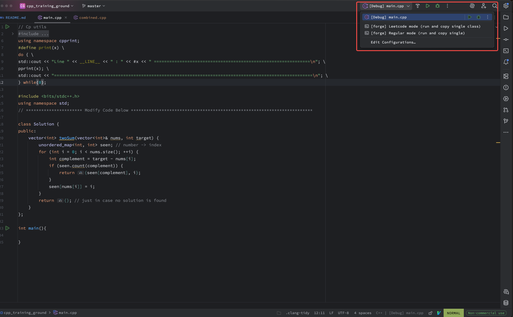

# 💥 cpp_training_ground

This repo is my go-to setup for solving algorithmic challenges on LeetCode and Codeforces.  
It’s also a playground for experimenting with modern C++ features.  
Sharing it here so others can benefit from a clean and convenient template — and maybe have a little fun along the way!

# 📝  Problem Statement and Solution
C++ is fast. C++ is powerful.  
C++ is also pain.

Here’s what this repo is trying to fix:

- **`main.cpp` template files are usually too long.**  
  Keeping all your templates and utility code in one file messy.  
  This setup splits everything into tiny `.hpp` files so your `main.cpp` can be clean and minimal.

- **Copy-pasting from different files for OJ submission**  
  However, if we want our cpp main file to be clean, we need to:
    - copy from different files
    - paste into a different buffer
    - remove all cout or print statements. 
    
  All of which takes up time, and are prone to mistakes. 
    
    
  **`forge.py`** fixes all that.  
      It fuses your entire codebase into one clean file, optionally vaporizes print statements, and even copies the result straight to your clipboard — like a compiler’s personal assistant on caffeine.


- **`cout` is clunky.**  
  Printing a vector shouldn’t feel like writing assembly.  
  Enter [cpprint](https://github.com/dcchan98/cpprint) — my mini header-only library that gives C++ some *Python swagger*.  
  You don’t need it, but once you use it, you’ll judge everyone else’s `cout` setup.

Example:

```cpp
vector<vector<int>> mat = {{1,2,3},{4,5,6},{7,8,9}};

// ###### regular printing
for (size_t i = 0; i < mat.size(); ++i) {
    cout << "[ ";
    for (size_t j = 0; j < mat[i].size(); ++j) {
        cout << mat[i][j];
        if (j + 1 < mat[i].size()) cout << ", ";
    }
    cout << " ]";
    if (i + 1 < mat.size()) cout << "\n";
}
    cout << endl;
    
// ###### pprint 
pprint(mat);
```


---

# ⚙️ Running and Testing

We basically run this project in three ways:

1. 🧩 **Debug mode:** just compile and run `main.cpp`.
2. ⚒️ **Regular mode:** let `forge.py` compile, merge everything into one file, remove all prints, and copy it to your clipboard.
3. 🧙‍♂️ **LeetCode mode:** same as Forge mode, but it only extracts your `Solution` class — perfect for one-click submissions. 

The scripts are as shown below.

### 🧩 Compile and Run Manually
```bash
g++ -std=c++23 main.cpp -o bin/main
./bin/main            # macOS / Linux
# bin\main.exe        # Windows (MinGW)
```
---
## 🐍 Python Forge
### 🔧 Regular Mode (All the code wanted)
Generate the full combined file, compile, and copy to clipboard:
```bash
python3 forge.py --remove_prints --run --copy
```
### 💡 LeetCode Mode (Only single class wanted)
Generate and copy only the `Solution` class version:
```bash
python3 forge.py --run
python3 forge.py --remove_prints --copy --single_class Solution
```
---
## 🧠 Run Configuration Support 
- **For CLion users:** Pre-made run configs are included  
 💡 Fun fact: CLion is now [free for non-commercial use!](https://blog.jetbrains.com/clion/2025/05/clion-is-now-free-for-non-commercial-use/)
    
- For those using other editors: you can set up your own run configs if you find it convenient.


## 🧰 Requirements

- **g++** with at least **C++20** support.  
  **C++23** is recommended for extra perks — like *deducing `this`* in local lambdas and other modern C++ magic.
- Ability to `#include <bits/stdc++.h>`. [Follow this](https://www.youtube.com/watch?v=3wMR7RCDgYw) to set up the header file if needed. Usually needed for those using macs. 
- **Python 3** — required to run the **forge** script.

In short, as long as you can do this in the terminal:

1. Compile a any C++ file with `#include <bits/stdc++.h>`:
```bash
g++ -std=c++23 main.cpp -o bin/main
```
2. Run python3:
```bash
python3 hello_world.py
```


# 📝 dc_notes 

Everything I can’t remember: tricky syntax, weird STL quirks, or how my own utility methods work — it all goes here.  
Think of it as my personal **competitive programming cheat sheet**, except it also compiles. You can add your notes here if needed.

Running dc_notes
```bash
# Compile
g++ -std=c++23 dc_notes.cpp -o bin/dc_notes

# Run
./bin/dc_notes      # for mac and linux
# bin\dc_notes.exe  # for windows
```

# ⚡ Advanced – Making `cpp_training_ground` Your Own

### 🧩 C++
- Add more helper code in the `cp_util` folder.
- Write your own notes or frequently used snippets in `dc_notes.cpp`.
- You can modify or extend pretty much anything — these are just examples!

### 🐍 Python
- Modify `forge.py` to tweak the generation logic — for example, changing which prefixes are removed.
- Again, feel free to customize any part of the script to fit your workflow.


For a full list of available options, run:

```bash
python3 forge.py --help
```


